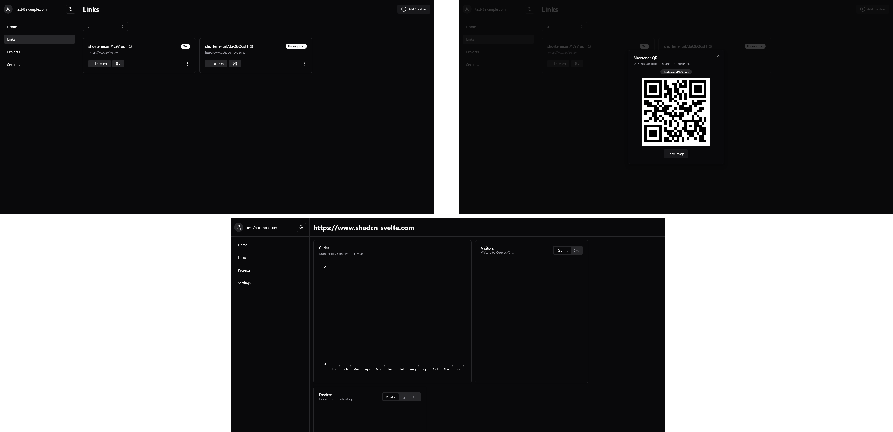

# Link Shortener

Link Shortener is a site to manage your short urls while providing analytics to the url traffics.
[Demo Here](https://shortener.tzgyn.com)

## Preview



### One Click Deploy on Railway

[](https://railway.app/template/bWnD5H?referralCode=bSruGU)

## Development

### Frontend

```bash
bun install
bun --bun run dev
```

### Redirect

```bash
bun install
bun --hot run src/index.ts
```

## Deployment

### Frontend

```bash
bun install
bun run build
bun --bun run build
```

### Redirect

```bash
bun install
bun run src/index.ts
```
